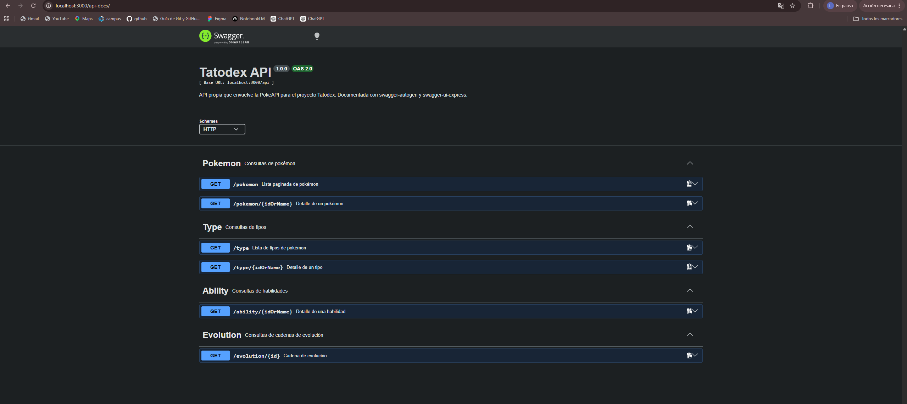
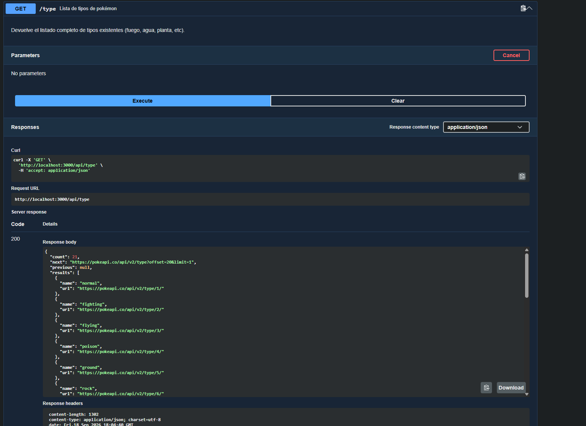
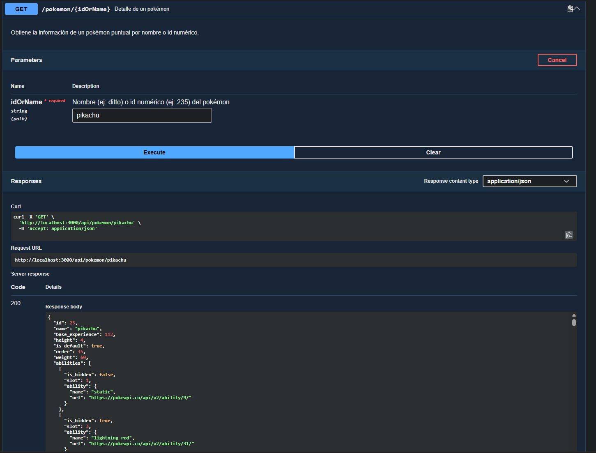
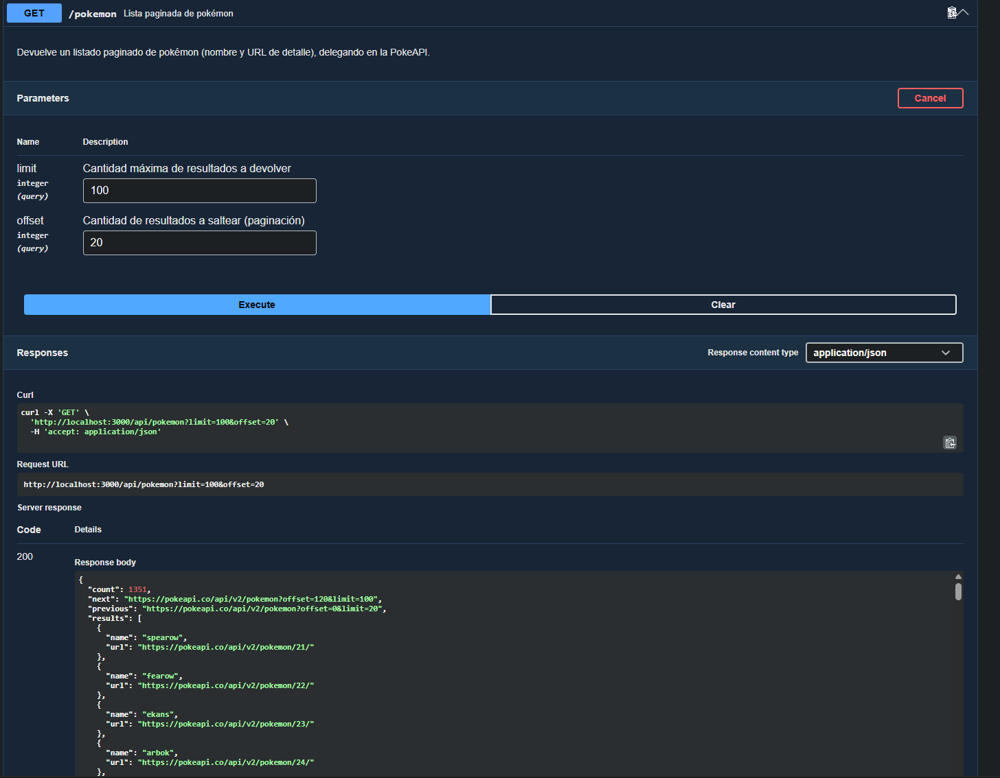
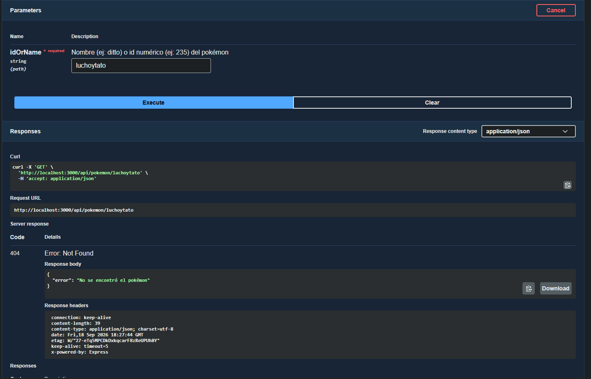

# TP: Documentación de una API con Swagger — Tatodex

## 1. Selección y análisis de la API

- **Proyecto seleccionado:** Tatodex, una mini Pokédex web (TP anterior) que permite buscar un pokémon por nombre o id y muestra su imagen, tipos, peso y altura.
- **Descripción:** el frontend (`index.html`, `style.css`, `script.js`) toma lo que el usuario escribe en el buscador y muestra la ficha del pokémon correspondiente.
- **Tipo de API:** originalmente el proyecto consumía una **API externa** (PokeAPI, `https://pokeapi.co/api/v2`) directamente desde el navegador. Para este TP se agregó una **API propia** en Node.js/Express que actúa como capa intermedia hacia PokeAPI, de forma de tener endpoints propios para documentar con `swagger-autogen`.
- **URL base de la API propia:** `http://localhost:3000/api`
- **URL base de la API externa que consume por detrás:** `https://pokeapi.co/api/v2`

### Endpoints

| Método | Endpoint                  | Descripción                                                                 |
|--------|----------------------------|------------------------------------------------------------------------------|
| GET    | `/api/pokemon`             | Lista paginada de pokémon (`limit`, `offset`)                               |
| GET    | `/api/pokemon/:idOrName`   | Detalle de un pokémon por nombre o id                                       |
| GET    | `/api/type`                | Lista de todos los tipos de pokémon                                         |
| GET    | `/api/type/:idOrName`      | Detalle de un tipo, incluye los pokémon que pertenecen a ese tipo           |
| GET    | `/api/ability/:idOrName`   | Detalle de una habilidad (ability)                                          |
| GET    | `/api/evolution/:id`       | Cadena de evolución completa a partir de su id                              |

> La PokeAPI es de solo lectura, por eso todos los endpoints son GET. No existen operaciones POST/PUT/PATCH/DELETE porque la API elegida no las soporta.

## 2. Integración de Swagger

Se usaron las herramientas vistas en clase:

- **`swagger-autogen`**: escanea `routes/pokemon.routes.js`, lee los comentarios `#swagger.*` ubicados dentro de cada handler y genera `swagger-output.json`.
- **`swagger-ui-express`**: sirve ese JSON como interfaz interactiva.

Estructura agregada:

```
server.js               → arranca Express, monta /api y /api-docs, sirve el frontend estático
routes/pokemon.routes.js→ endpoints propios + comentarios swagger-autogen
swagger.js               → script que genera swagger-output.json
swagger-output.json      → especificación generada (no se edita a mano)
```

Cómo se generó la documentación:

```bash
npm install
npm run swagger-autogen   # genera swagger-output.json a partir de los comentarios en las rutas
npm start                 # levanta el servidor en http://localhost:3000
```

**Acceso a la documentación:** [http://localhost:3000/api-docs](http://localhost:3000/api-docs)

## 3. Documentación de los endpoints

Cada endpoint fue documentado con `#swagger.tags`, `#swagger.summary`, `#swagger.description`, sus parámetros de ruta/consulta y sus respuestas posibles. Ejemplo (`GET /api/pokemon/:idOrName`):

- **Parámetro de ruta:** `idOrName` (string, requerido) — nombre o id del pokémon.
- **Respuesta 200:** objeto del pokémon (id, name, weight, height, sprites, types).
- **Respuesta 404:** `{ "error": "No se encontró el pokémon" }`
- **Respuesta 500:** `{ "error": "Error interno del servidor" }`

El detalle completo de parámetros y respuestas de los 6 endpoints está disponible en Swagger UI y en `swagger-output.json`.

## 4. Modelos y estructuras de datos

Ejemplo de modelo documentado para el endpoint de detalle de pokémon:

```json
{
  "id": 132,
  "name": "ditto",
  "weight": 40,
  "height": 3,
  "sprites": { "front_default": "string (URL de la imagen)" },
  "types": [
    { "slot": 1, "type": { "name": "normal", "url": "string" } }
  ]
}
```

| Propiedad | Tipo   | Descripción                              |
|-----------|--------|-------------------------------------------|
| id        | number | Identificador numérico del pokémon        |
| name      | string | Nombre del pokémon                        |
| weight    | number | Peso en hectogramos                       |
| height    | number | Altura en decímetros                      |
| sprites   | object | URLs de imágenes del pokémon              |
| types     | array  | Tipos a los que pertenece el pokémon      |

## 5. Prueba de los endpoints

Las capturas fueron tomadas desde el propio Visual Studio, aun así, adjunto pruebas que corre en web



Ahora si, las imagenes de los endpoints


- **GET simple:** `GET /api/type` → 200, 0.


- **GET con parámetro de ruta:** `GET /api/pokemon/pikachu` → 200, devuelve la ficha de Pikachu.


- **GET con parámetros de consulta:** `GET /api/pokemon?limit=100&offset=20` → 200, devuelve 100 resultados.


- **Caso de error 404:** `GET /api/pokemon/luchoytato` → 404, `{ "error": "No se encontró el pokémon" }`.

## 6. Manejo de respuestas y errores

| Código | Cuándo se produce                                              |
|--------|------------------------------------------------------------------|
| 200    | La consulta se resuelve correctamente                           |
| 400    | Parámetro de ruta inválido (ej: id de evolución no numérico)    |
| 404    | El recurso solicitado no existe en PokeAPI (pokémon/tipo/habilidad/cadena inexistente) |
| 500    | Error inesperado al consultar PokeAPI o al procesar la respuesta |

## 7. Problemas encontrados y solución

- **El proyecto no tenía backend propio**, solo hacía `fetch` directo a PokeAPI desde el navegador. Para poder usar `swagger-autogen` + `swagger-ui-express` (que documentan rutas de un servidor Express) se creó un backend Express que envuelve los endpoints de PokeAPI que ya usaba el proyecto (ver `New Collection.postman_collection.json` del TP anterior).
- **`swagger-autogen` no detectaba los comentarios `#swagger.*`** cuando se los colocaba antes de `router.get(...)`. Se solucionó moviendo el bloque de comentarios como primera sentencia **dentro** del callback de cada ruta, que es el formato que la librería reconoce.
- **Los paths generados no incluían el prefijo `/api`** porque `swagger-autogen` documenta las rutas tal como están escritas en el router. Se solucionó configurando `basePath: "/api"` en `swagger.js`, que coincide con el prefijo usado al montar el router en `server.js`.
